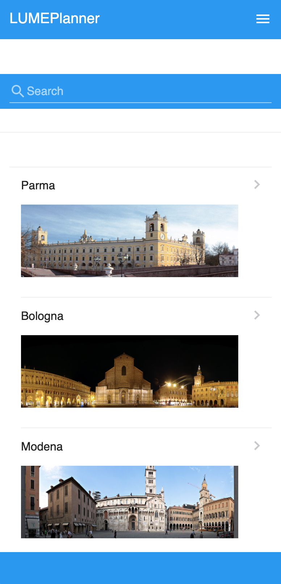

# LUME Project.

LUME stands for (LUoghi Musei e Eventi) which  in Italian means Places, Museums and Events

The project aims to proivide a tool (mobile app) for local and international tourists that could help them to discover new and unexpected places and events in Emilia Romagna.

[The official web site of the project ](http://www.lumeplanner.it/index.php/it/)

The main result of LUMEPlannER project is the creation of customizable paths for users that are interested on 
gastronomical turism (local wines, cheese, ham and other fine local foods) or historical attractions (like museums, casteles etc..) in the Emilia Romagna Region. 
Users could then use those paths by using LumePlanner App to plan their visits and optimize their time.             

Though LUME Project is now discontinued, the mobile app, LUME PlannER APP is still alive. 

The front-end of the app is now available in this repository. 

